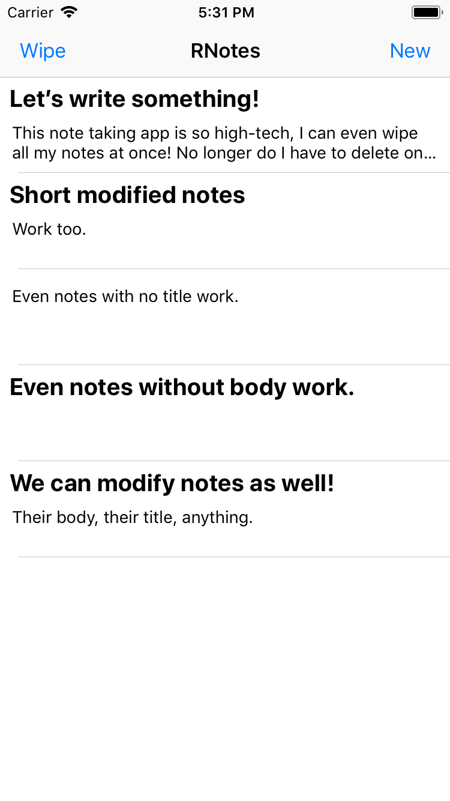
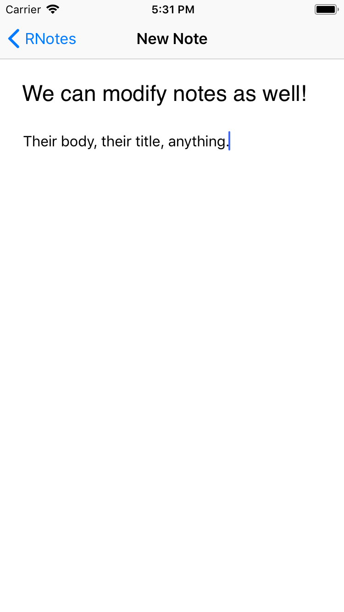

# RNotes
###### Keep all your important notes in one place. Then wipe them all!
 
This project shows off the **Reactant** architecture. This time creating a beautiful note taking application that saves your notes as long as you don't accidentally press the inconvenient `Wipe` button in the `NavigationBar`.

  

    It looks something like this:  
    

 

    Modifying notes also works like a charm!  
    

 

Deleting single notes is not implemented, a PR would be greatly appreciated!

## Authors
Me

## License
Use the code however you want if it's in accordance with `LICENSE`. Thanks!
